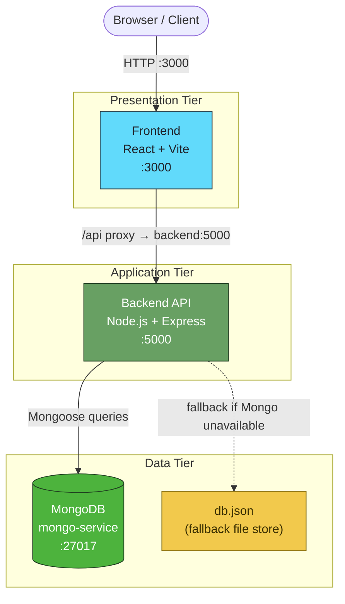

# RealEstate CRM

A full-stack Real Estate CRM application for managing properties, leads, and contacts, with role-based access for Admins, Managers, and Agents.

## Tech Stack

- **Frontend:** React + Vite
- **Backend:** Node.js + Express
- **Database:** MongoDB (with a JSON-file fallback for local/no-Mongo setups)
- **Containerization:** Docker & Docker Compose

## Prerequisites

- [Docker](https://docs.docker.com/get-docker/) and [Docker Compose](https://docs.docker.com/compose/install/)
- Node.js (only needed if running services outside Docker)

## Getting Started

### 1. Clone the repository

```bash
git clone <your-repo-url>
cd RealEstate
```

### 2. Configure environment variables

Copy the sample env files and adjust as needed:

```bash
cp backend/.env.sample backend/.env
cp frontend/.env.sample frontend/.env
```

### 3. Start the application

```bash
docker compose up -d --build
```

This starts three containers:

| Service    | Container Name | Port                          |
|------------|-----------------|-------------------------------|
| Frontend   | `frontend`      | `3000`                        |
| Backend    | `backend`       | `5000`                        |
| MongoDB    | `mongo-service` | `27017`                       |

The frontend is available at **http://localhost:3000**.

### 4. Seed the database

On first run, the database is empty. Seed it with default users and sample properties:

```bash
docker exec -it backend node seed.js
```

This creates the following accounts:

| Role    | Email             | Password    |
|---------|-------------------|-------------|
| Admin   | admin@crm.com     | admin123    |
| Manager | manager@crm.com   | manager123  |
| Agent   | agent@crm.com     | agent123    |

> ⚠️ These are default development credentials only. Change them before deploying to production.

## Architecture

The application follows a classic 3-tier architecture, fully containerized with Docker Compose:



**Presentation Tier** — React SPA served by Vite's dev server. All API calls are routed through Vite's proxy under `/api`, which forwards to the backend using its Docker service name (`backend`), not `localhost`.

**Application Tier** — Express REST API handling auth, business logic, and routing. Communicates with MongoDB via Mongoose; falls back to a local JSON file (`db.json`) if no MongoDB connection is configured.

**Data Tier** — MongoDB is the primary datastore, persisted via a Docker volume (`./backend/mongo-data`). When running in JSON-file mode, data is persisted to `./backend/db.json` via a bind mount instead.

All three services communicate over a shared Docker bridge network (`app-network`), with only the frontend and backend ports published to the host.

## Project Structure

```
RealEstate/
├── backend/
│   ├── controllers/
│   ├── models/
│   ├── routes/
│   ├── middleware/
│   ├── config/
│   ├── seed.js
│   ├── server.js
│   └── .env.sample
├── frontend/
│   ├── src/
│   ├── vite.config.js
│   └── .env.sample
└── docker-compose.yml
```

## Data Persistence

- **MongoDB data** is persisted to `./backend/mongo-data` via a Docker volume.
- If the backend falls back to JSON-file storage (no MongoDB connection configured), data is persisted to `./backend/db.json`, which is mounted into the container so it survives restarts.

> Note: `backend/mongo-data/` and `backend/db.json` are git-ignored — they contain local runtime data and, in the case of `db.json`, hashed user credentials. Do not commit them.

## Common Commands

```bash
# View logs for a specific service
docker logs -f backend
docker logs -f frontend

# Rebuild a single service after changes
docker compose up -d --build backend

# Stop all services
docker compose down

# Stop and remove volumes (⚠️ deletes MongoDB data)
docker compose down -v
```

## Troubleshooting

**Login fails with a 500 error, but the backend works fine via `curl`:**
Check the frontend's Vite dev server proxy config in `frontend/vite.config.js`. Inside Docker, the proxy target must use the Docker service name, not `localhost`/`127.0.0.1`:

```js
server: {
  proxy: {
    '/api': 'http://backend:5000'
  }
}
```

**Port already in use (e.g. `3000` or `5000`):**
Another container or process is likely already bound to that port. Check with:

```bash
docker ps --filter "publish=3000"
```

**No `db.json` / login has no users:**
The database hasn't been seeded yet. Run:

```bash
docker exec -it backend node seed.js
```

## License

Specify your license here (e.g. MIT).